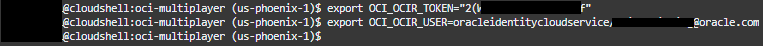

# Containerize and migrate to OCI Container Instances

## Introduction

In this lab we will create container images for the application components and deploy them to the Container Instances service. Container Instances is an excellent tool for running containerized applications, without the need to manage any underlying infrastructure. Just deploy and go.

To help streamline the process, you'll use a custom script to create and publish container images to the OCI Container Registry. Container Registry makes it easy to store, share, and managed container images. Registries can be private (default) or public.

**_Important_** The instructions in this lab are designed around the Cloud Shell and utilize some of the built-in session variables. Should you choose to complete this outside of cloud shell, you will need to locate those resource OCID's manually (Web UI or OCI CLI).

Estimated Lab Time: 15 minutes


### Prerequisites

* An Oracle Free Tier or Paid Cloud Account

## Task 1: Configure alternate CLI Authentication

While the cloud shell is pre-configured to authenticate based on logged-on user credentials, it can be quite useful to understand how easy it is to leverage alternate authenticate methods. The following is also useful when leveraging the OCI CLI outside of Cloud Shell.

In this section we will configure the CLI to use APIKey-based authentication.

1. Obtain user OCID - click the _Profile_ icon in the top right of the cloud console, then click your username.

    

2. Copy your user OCID and store it in a text file.

    


3. Return to Cloud Shell and retrieve your tenancy OCID. Store it in a temporary location (i.e. text file).

    ```
    <copy>echo $OCI_TENANCY</copy>
    ```

4. Initiate CLI configuration.

    ```
    <copy>oci setup config</copy>
    ```


    

5. You will be prompted with a series of questions. When requested, enter your user OCID, your tenancy OCID, a profile name, and the name of the region you are using (a list will be presented for reference).

    

    **_note:_** For this step I have opted to assign a profile name of `workshop`. If you do not set a value, it will become `DEFAULT`. Profile name is always stored in ALL CAPS and must be referenced accordingly.

6. When asked whether to create a new `API Signing RSA key pair`, type 'Y' and press enter, then continue pressing enter to accept all defaults.

7. Now...we can utilize the built-in authentication in Cloud Shell to upload the public portion of the API signing key to our user profile.

    ```
    <copy>oci iam user api-key upload --user-id <paste user OCID> --key-file ~/.oci/oci_api_key_public.pem</copy>
    ```

    

8. Time to test it out!

    ```
    <copy>oci iam availability-domain list --auth api_key --profile WORKSHOP --config-file ~/.oci/config</copy>
    ```

    **_NOTE:_** The profile name you entered will automatically be converted to all CAPS. Make sure to do the same when you enter the CLI command.

9. You should see either 1 or 3 AZs depending on which region you are using.

    


## Task 2: Containerize the application

In this task you will create a container image for both the server and the web pieces of the application. The container images will be stored in the OCI Container Registry for deployment to Container Instances (and eventually OKE).

1. Generate an Auth token for your cloud user; this is required to authenticate to OCI Container Registry.

    ```
    <copy>oci iam auth-token create --description "DevLive-Workshop" --user-id <paste user OCID> --query 'data.token' --raw-output</copy>
    ```

2. Copy the output string and store it in a safe place. Then create an environment variable as well.

    ```
    <copy> export OCI_OCIR_TOKEN="<auth-token-here>"</copy>
    ```

    _note:_ remove the `<>` when pasting your auth token

3. Create an environment variable for your email address.

    ```
    <copy>export OCI_OCIR_USER=<OCI_email_or_IAM_user_id></copy>
    ```

    

4. Make sure you're in the `devlive-save-the-wildlife` directory.

    ```
    <copy>cd ~/devlive-save-the-wildlife</copy>
    ```

5. Run the script to set the environment. This script will

    * check dependencies

    * create self-signed certificates, if needed

    * log into the container registry to validate credentials

    * print component versions

    ```
    <copy>npx zx scripts/setenv.mjs</copy>
    ```

6. Create and publish the **`server`** container image.

    ```
    <copy>npx zx scripts/release.mjs server</copy>
    ```

7. Copy the `Released:` path at the end of the command execution and store it in a text document.

    

8. Create and publish the **`web`** container image.

    ```
    <copy>npx zx scripts/release.mjs web</copy>
    ```

9. Copy the `Released:` path for this one as well; store it in a text documnt.


## Task 3: Deploy to Container Instances

Now to grab just a few more pieces of information and launch the Container Instances resource.

**_NOTE:_** If you are using a custom compartment for the workshop (not the root compartment) make sure to replace any occurrence of `$OCI_TENANCY` with the full compartment OCID.

1. You may either navigate the OCI console to locate the OCID of your subnet, or run the following CLI command. Copy the Subnet OCID to a text file.

    ```
    <copy>oci network subnet list -c $OCI_TENANCY --display-name "multiplayer public subnet" --query 'data[0].id' --raw-output</copy>
    ```

    _note:_ if you are not using the root compartment, replace `$OCI_TENANCY` with the OCID of your chosen compartment.

2. Retrieve the Availability Domain label and copy to a text file.

    ```
    <copy>oci iam availability-domain list --query 'data[?contains ("name",`AD-1`)]|[0].name' --raw-output</copy>
    ```

3. Retrieve the object storage namespace. This is required when logging in with a federated user (default for `Always Free` accounts).

    ```
    <copy>oci os ns get -c $OCI_TENANCY --query 'data' --raw-output</copy>
    ```

    

4. Finally - you'll need to convert your OCIR username and auth token / password to _base64_ as requirec by the CLI.

    - For federated users (default):

        ```
        <copy>
        echo -n '<os namespace>/<username>' | base64
        echo -n '<auth token>' | base64
        </copy>
        ```

        

    - For IAM users:

        ```
        <copy>
        echo -n '<tenancy name>/username>' | base64
        echo -n '<auth token>' | base64
        </copy>
        ```

    Copy the values to your text file.

    **_NOTE:_** If the **base64** command preduces a carriage return for the username, simply paste into a text file and remove the carriage return

5. Copy the following command to a text file, modify the <placeholder> values, then paste into Cloud Shell.

    ```
    <copy>oci container-instances container-instance create --display-name oci-MultiPlayer \
    --availability-domain <AD Name> --compartment-id <Compartment OCID> \
    --containers ['{"displayName":"ServerContainer","imageUrl":"<release path for server image>","resourceConfig":{"memoryLimitInGBs":8,"vcpusLimit":1.5}},{"displayName":"WebContainer","imageUrl":"<release path for Web image>","resourceConfig":{"memoryLimitInGBs":8,"vcpusLimit":1.5}}'] \
    --shape CI.Standard.E4.Flex --shape-config '{"memoryInGBs":16,"ocpus":4}' \
    --vnics ['{"displayName": "ocimultiplayer","subnetId":"<subnet OCID>"}'] \
    --image-pull-secrets ['{"password":"<base-64-encoded-auth-token>","registryEndpoint":"<OCIR endpoint>","secretType":"BASIC","username":"<base-64-encoded-username>"}'] \
    --config-file ~/.oci/config --profile WORKSHOP --auth api_key</copy>
    ```

   _The command will look something like this (notice we created variables for a few of the parameter values - totally optional):_

    Here's a breakdown of the command:
    - _oci container-instances container-instance create_ - This is the core cli command with service name, service component, and action to take `create`.   
    - _--display-name_ oci-MultiPlayer - This is the display name for the container instance.  
    - _--availability-domain_ <AD Name> - This specifies the availability domain in which to create the container instance.
    - _--compartment-id_ <Compartment OCID> - This specifies the compartment in which the container instance will be created.
    - _--containers_ - This specifies the containers to be created within the container instance. This is an array of JSON objects, with each object representing a container. In this case, there are two containers: one for the server and one for the web application.
    - _--shape_ CI.Standard.E4.Flex - This specifies the shape of the container instance.
    - _--shape-config_ '{"memoryInGBs":16,"ocpus":4}' - This specifies the shape configuration for the container instance.
    - _--vnics_ - This specifies the virtual network interfaces to be attached to the container instance. This is an array of JSON objects, with each object representing a virtual network interface.
    - _--image-pull-secrets_ - This specifies the image pull secrets to be used by the container instance. This is an array of JSON objects, with each object representing an image pull secret. Username and password must be **base64** encoded
    - _--config-file_ ~/.oci/config - This specifies the configuration file to be used for the OCI CLI.
    - _--profile_ WORKSHOP - This specifies the OCI CLI profile to use.
    - _--auth api key_ - This specifies the authentication method to be used for the OCI CLI.


        

6. In the Web UI, you can navigate to **`Developer Services`** -> `Container Instances` to watch the progress of the deployment. Observe when the two containers move to an Active state.

    

7. Locate the private IP address for your Container Instance.

    

## Task 4: Modify the Load Balancer

In this 4th and final task, you will add the Container Instance private IP address to the backend set of the load balancer that was deployed as part of the first lab.

1. Create an environment variable for the private IP address of your Container Instance.

    ```
    <copy>export ciPrivIp="<paste ip here>"</copy>
    ```

2. Create an environment variable for the load balancer. This command will list all load balancers (should just be one) in the compartment named **`LB Multiplayer`**

3. Run the following series of commands.

    ```
    <copy>
    #Retrieve the existing load balancer backends
    serverBeName=($(oci lb backend list --backend-set-name lb-backend-set-server --load-balancer-id $lbOcid --query 'data[0].name' --raw-output))
    webBeName=($(oci lb backend list --backend-set-name lb-backend-set-web --load-balancer-id $lbOcid --query 'data[0].name' --raw-output))

    # Delete the existing load balancer backends
    oci lb backend delete --backend-name $serverBeName --backend-set-name lb-backend-set-server --load-balancer-id $lbOcid --force
    oci lb backend delete --backend-name $webBeName --backend-set-name lb-backend-set-web--load-balancer-id $lbOcid --force

    #Create new backends for the Container Instance resource
    oci lb backend create --backend-set-name lb-backend-set-server --ip-address $ciPrivIp --port 3000 --load-balancer-id $lbOcid
    oci lb backend create --backend-set-name lb-backend-set-web --ip-address $ciPrivIp --port 80 --load-balancer-id $lbOcid
    </copy>
    ```

    

4. Once you see the **OK** status, you can navigate to the load balancer public IP in your browser (return to the tab from lab one and refresh, or open a new window).

    ```
    <copy>oci lb load-balancer get --load-balancer-id $lbOcid --query 'data."ip-addresses"[0]."ip-address"' --raw-output</copy>
    ```


## Acknowledgements

* **Author** - Victor Martin - Technology Product Strategy Director - EMEA
* **Author** - Wojciech (Vojtech) Pluta - Developer Relations - Immersive Technology Lead
* **Author** - Eli Schilling - Developer Advocate - Cloud Native and DevOps
* **Last Updated By/Date** - March, 2023
