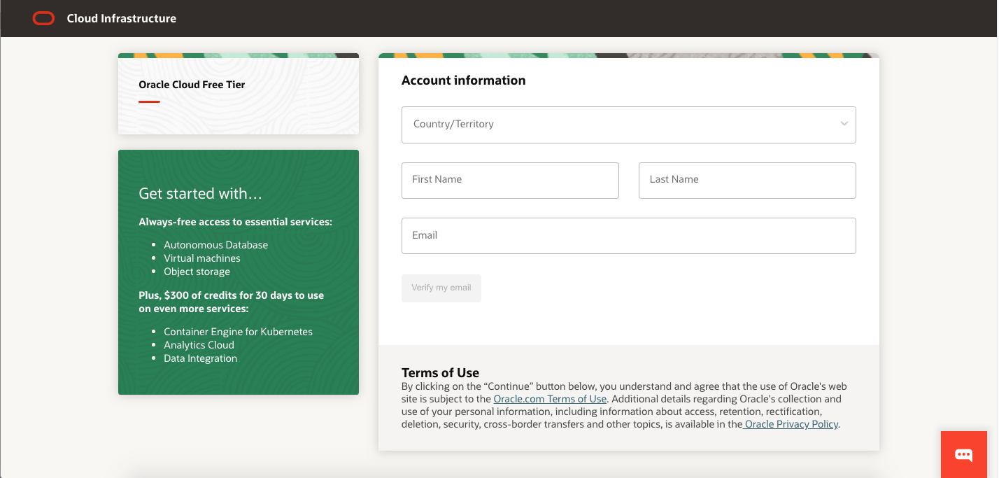
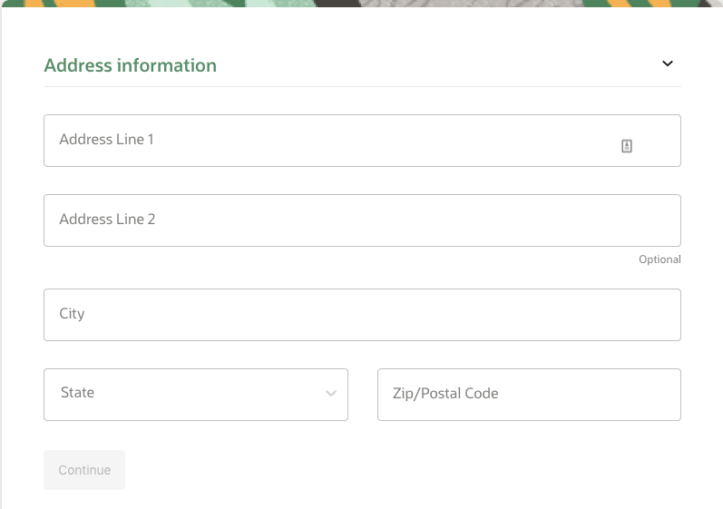
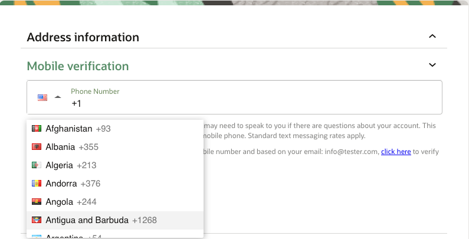
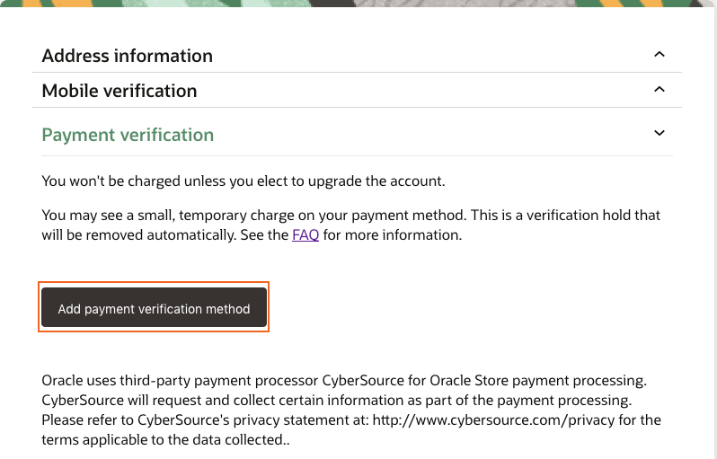
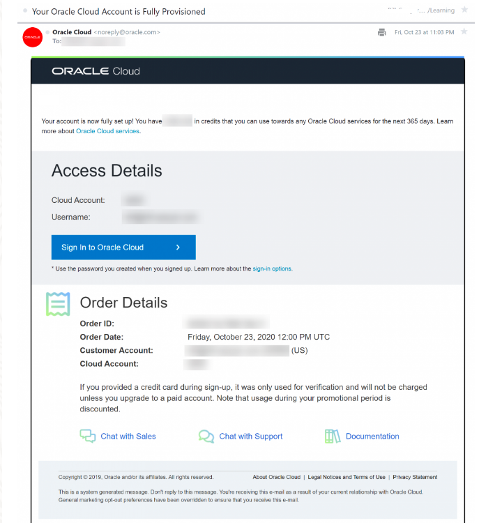

# Introduction

## Introduction - The power of Cloud Native on Oracle Cloud

Thank you for choosing **DevLive-Save-the-Wildlife**! This workshop is a valuable opportunity to enhance your cloud computing skills and learn how to build and deploy multiplayer applications in the cloud. With Cloud Native on Oracle Cloud, you'll discover the power of deploying a _`Three.js`_ application to the cloud, modernizing it, and enhancing it with immersive experiences for Metaverse and Gaming.  

_`Three.js`_ is a popular JavaScript library for creating 3D graphics and animations in web browsers, and there are other options available, such as _`Babylon.js`_ and _`A-Frame`_. The principles of 3D graphics and animation are transferable between these libraries, and the backend and concurrency management principles that are essential for Metaverse applications are also applicable across all three libraries. Part 1 of this workshop will focus on _`Three.js`_, but we will cover other options in the future.

With _`Three.js`_ and Cloud Native on Oracle Cloud, you can create engaging Metaverse applications for your customers, employees, and partners. Whether it's virtual showrooms, immersive training simulations, product demonstrations, or games, _`Three.js`_ and Cloud Native on Oracle Cloud provide the scalability, performance, and availability you need to succeed in the Metaverse.

Estimated Lab Time: 60 minutes

### Objectives
In this workshop, you will learn how to:

* Deploy a simple Three.js application to OCI Compute with Terraform, using Ansible to provide all requisite app configurations.

* Create container images of the application components and migrate them to OCI Container Images.

* Add _`Redis`_ and _`NginX`_ controller to your application to support scalability, while deploying to Oracle Container Engine for Kubernetes (OKE).

### Prerequisites

* An Oracle Free Tier or Paid Cloud Account
* [Familiarity with the OCI console](https://docs.oracle.com/en-us/iaas/Content/GSG/Concepts/console.htm)

* Basic familiarity with app containerization

* [Basic familiarity with OCI Container Instances](https://www.oracle.com/cloud/cloud-native/container-instances/)

* [Basic familiarity with OKE](https://www.oracle.com/cloud/cloud-native/container-engine-kubernetes/)

## Task 1: Create your Free Trial Account

If you already have a cloud account, skip to the **Get Started** section.

1. Open up another browser window or tab to access the Oracle Cloud account registration form at [oracle.com/cloud/free](https://signup.cloud.oracle.com/)

    You will be presented with a registration page.

    

2. Enter the following information to create your Oracle Cloud Free Tier Account.

    * Choose your **Country**

    * Enter your **Name** and **Email**

3. Once you have entered a valid email address, select the **Verify my email** button. The screen will appear as follows after you select the button:

    

4. Go to your email. You will see an account validation email from Oracle in your inbox. The email will be similar to the following:

    

5. Click the link (if possible) or copy and paste the link into your browser.

6. Enter the following information to create your Oracle Cloud Free Tier account:

    * Choose a **Password**

    * Enter your **Company Name**

    * Your **Cloud Account Name** will generate automatically based on your inputs. You can change that name by entering a new value. Remember what you wrote.  You'll need this name later to sign in.

    * Choose a **Home Region**. our Home Region cannot be changed once you sign-up.

    * Click **Continue**

    

7. Enter your Address information and click **Continue**

    

8. Choose your country and enter a mobile number for verification. Click the **Text me a code** button.

    

9. Once you receive your code, enter it and click **Verify My Code**.

    

10. Click the **Add payment verification method** button.

    

11. Choose the verification method. In this case, click the **Credit Card** button. Enter your information and payment details.

    **_NOTE:_**This is a free credit promotion account. You will not be charged unless you elect to upgrade the account.

    

12. Once your payment verification is complete, review and accept the agreement by clicking the check box. Click the **Start my free trial** button.

    

13. Your account is provisioning and should be available soon! You might want to log out as you wait for your account to be provisioned. You'll receive two emails from Oracle: one will be the initial notification that provisioning is underway, and the second one will be about provisioning finishing up:

    

## Acknowledgements

* **Author** - Victor Martin - Technology Product Strategy Director - EMEA
* **Author** - Wojciech (Vojtech) Pluta - Developer Relations - Immersive Technology Lead
* **Author** - Eli Schilling - Developer Relations - Cloud Native and DevOps
* **Last Updated By/Date** - March, 2023