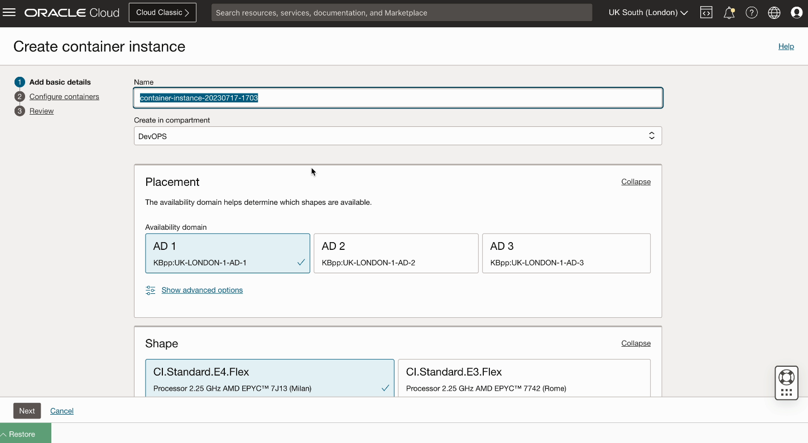
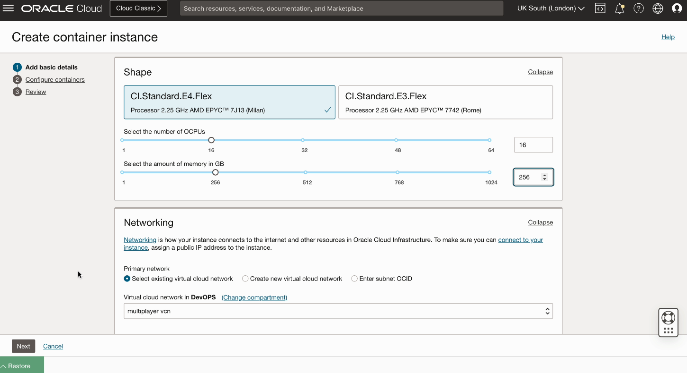
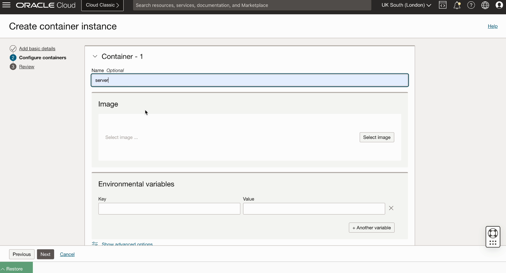
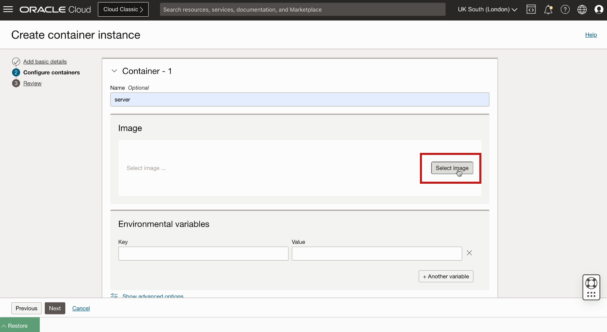
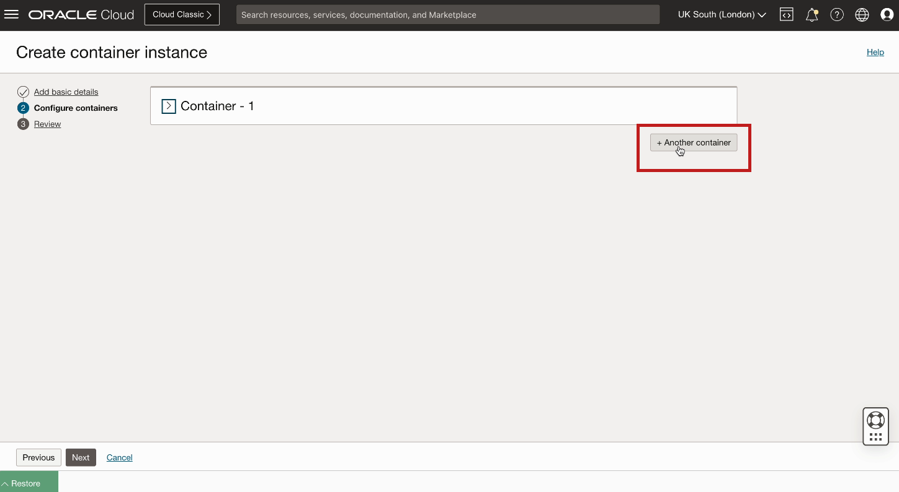
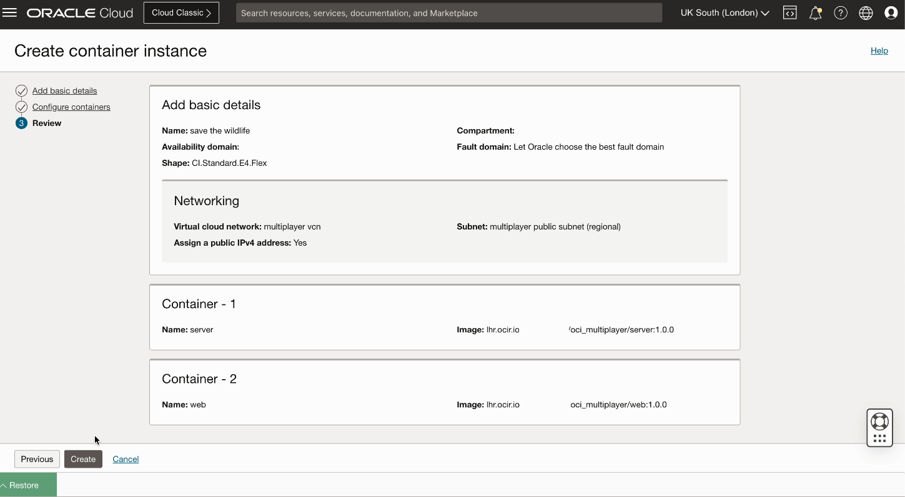
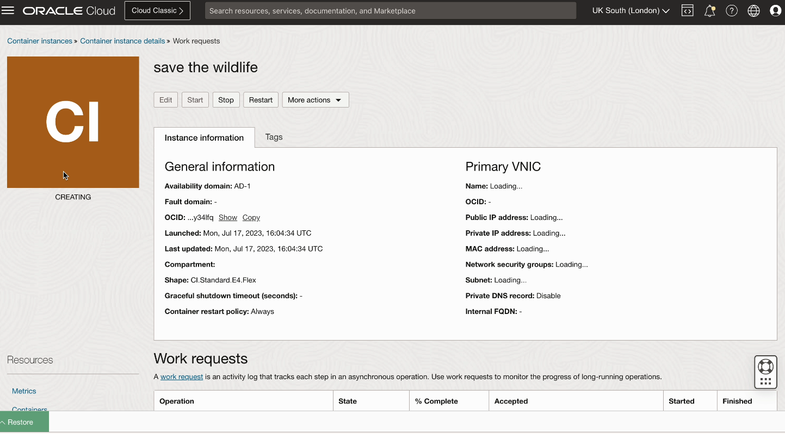
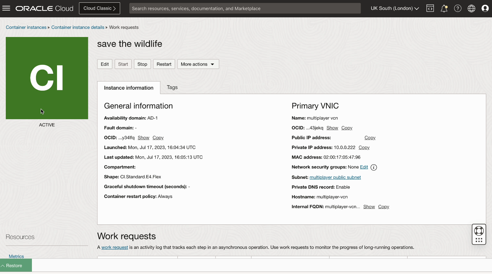

# Containerize and migrate to OCI Container Instances

## Introduction


In this lab, we will create container images for the application components and deploy them to the Container Instances service. Container Instances are an excellent tool for running containerized applications, without the need to manage any underlying infrastructure. Just deploy and go.

To help streamline the process, you'll use a custom script to build and publish container images to the OCI Container Registry. Container Registry makes it easy to store, share, and manage container images. Registries can be private (default) or public.


Estimated Lab Time: 15 minutes


### Prerequisites

* An Oracle Free Tier or Paid Cloud Account

## Task 1: Containerize the Application

In this task, you will create a container image for both the server and  web components of the application. The container images will be stored in the OCI Container Registry for deployment to Container Instances (and eventually OKE).

1. Generate an Auth Token for your Cloud user; this is required to authenticate to OCI Container Registry.

    ```
    <copy>oci iam auth-token create --description "OCW-Workshop" --user-id <paste user OCID> --query 'data.token' --raw-output</copy>
    ```

2. Then, copy the output string and store it somewhere safe. We will also create an environment variable to carry our auth token:

    ```
    <copy> export OCI_OCIR_TOKEN="<auth-token-here>"</copy>
    ```

    > **Note**: remove the `<>` when pasting your auth token.

3. We will also create an environment variable to hold our user ID: 

    ```
    <copy>export OCI_OCIR_USER=<OCI_IDCS_user_or_IAM_user_id></copy>
    ```

    

    > **Note**: when using a federated user (most common) you will need to include `oracleidentitycloudservice/` before your email address.

4. Making sure that we're in the right directory (`oci-oke-appdev-save-the-wildlife`) before we do anything else, let's execute:

    ```
    <copy>cd ~/oci-oke-appdev-save-the-wildlife</copy>
    ```

5. Then, we run the _`npx`_ script to set the environment. This script will:

    * Check dependencies on the environment

    * Create self-signed certificates, if necessary

    * Log into the container registry to validate credentials

    * Print component versions

    ```
    <copy>npx zx scripts/setenv.mjs</copy>
    ```

6. We then create and publish the **`server`** container image by executing the following command:

    ```
    <copy>npx zx scripts/release.mjs server</copy>
    ```

7. After the server container image has been published, we will copy the `Released:` path (which we can find at the above command's output) and store it in a text document.

    

8. And now, we repeat the same process, but the purpose now is to create and publish the **`web`** container image as well:

    ```
    <copy>npx zx scripts/release.mjs web</copy>
    ```

9. Finally, we repeat step 7 and copy the `Released:` path and save it in a text document for now.

## Task 2: Deploy to Container Instances

Now that both images have been created and published, lets deploy them to the Container Instances from OCI Console.

1. Using UI components navigate to the Container Instances.
**`Developer Services`** -> **`Container Instances`**.

2. Click on create new container instance.

3. Add basic details about your container.

    

4. Select shape and network (you can reuse network we created earlier in previous lab), click next once finished.

    

5. Add `server` to name.

    

6. Click `select image` container image from root compartment.

    

7. Select `server` container image and version from root compartment (depending on your setup you might need to change the repository to root).

    

8. Click `another container` and repeat the same process for `web`.

    

9. Once completed click `Next`.

    

10. Review and press `create` to confirm

    

11. Wait for Container Instances to be provisioned

    

    

Now that both images have been created and published, we just need to grab just a few more pieces of information and launch the Container Instances resource.

> **Note**: If you are using a custom compartment for the workshop (not the root compartment) make sure to replace any occurrence of `$OCI_TENANCY` with the full compartment OCID.

1. You may either navigate the OCI console to locate the OCID of your subnet or run the following CLI command. Copy the Subnet OCID to a text file.

    ```
    <copy>oci network subnet list -c $OCI_TENANCY --display-name "multiplayer public subnet" --query 'data[0].id' --raw-output</copy>
    ```

    > **Note**: if you aren't working within your tenancy's root compartment, replace the `$OCI_TENANCY` environment variable with the compartment OCID that you're using.

2. Retrieve the Availability Domain (AD) name and copy it to a text file.

    ```
    <copy>oci iam availability-domain list --query 'data[?contains ("name",`AD-1`)]|[0].name' --raw-output</copy>
    ```

3. Retrieve the OCI Object Storage namespace. This is required when logging in with a federated user (default for `Always Free` accounts).

    ```
    <copy>oci os ns get -c $OCI_TENANCY --query 'data' --raw-output</copy>
    ```

    

4. Finally - you'll need to convert your OCIR username and auth token/password to _base64_ format, as required by the CLI. For that, depending on your account's authentication status (federated user or IAM user), here are the commands required to achieve this conversion: 

    - For federated users (you'll most likely be in this group):

        ```
        <copy>
        echo -n '<os namespace>/<username>' | base64
        echo -n '<auth token>' | base64
        </copy>
        ```

        Here's an example of running the conversion:

        

    - For IAM users:

        ```
        <copy>
        echo -n '<tenancy name>/username>' | base64
        echo -n '<auth token>' | base64
        </copy>
        ```

    And remember to copy the newly generated base64-formatted values to a text file.

    > **Note**: if the **base64** output produces a new line or a carriage return character after the username, simply paste the output into a text file and remove the new line / carriage return.

5. Copy the following command to a text file, modify the <placeholder> values, then paste the full, edited command into your Cloud Shell instance:

    ```
    <copy>oci container-instances container-instance create --display-name oci-MultiPlayer \
    --availability-domain <AD Name> --compartment-id <Compartment OCID> \
    --containers ['{"displayName":"ServerContainer","imageUrl":"<release path for server image>","resourceConfig":{"memoryLimitInGBs":8,"vcpusLimit":1.5}},{"displayName":"WebContainer","imageUrl":"<release path for Web image>","resourceConfig":{"memoryLimitInGBs":8,"vcpusLimit":1.5}}'] \
    --shape CI.Standard.E4.Flex --shape-config '{"memoryInGBs":16,"ocpus":4}' \
    --vnics ['{"displayName": "ocimultiplayer","subnetId":"<subnet OCID>"}'] \
    --image-pull-secrets ['{"password":"<base-64-encoded-auth-token>","registryEndpoint":"<OCIR endpoint>","secretType":"BASIC","username":"<base-64-encoded-username>"}']</copy>
    ```

   The command will look something like this (notice we created variables for a few of the parameter values - totally optional):

    Here's a breakdown of the command:
    - _oci container-instances container-instance create_ - This is the core cli command with the service name, service component, and action to take `create`.   
    - _--display-name_ oci-MultiPlayer - This is the display name for the container instance.  
    - _--availability-domain_ <AD Name> - This specifies the availability domain in which to create the container instance.
    - _--compartment-id_ <Compartment OCID> - This specifies the compartment in which the container instance will be created.
    - _--containers_ - This specifies the containers to be created within the container instance. This is an array of JSON objects, with each object representing a container. In this case, there are two containers: one for the server and one for the web application.
    - _--shape_ CI.Standard.E4.Flex - This specifies the shape of the container instance.
    - _--shape-config_ '{"memoryInGBs":16,"ocpus":4}' - This specifies the shape configuration for the container instance.
    - _--vnics_ - This specifies the virtual network interfaces to be attached to the container instance. This is an array of JSON objects, with each object representing a virtual network interface.
    - _--image-pull-secrets_ - This specifies the image-pull secrets to be used by the container instance. This is an array of JSON objects, with each object representing an image pull secret. The username and password must be **base64** encoded
    - _--config-file_ ~/.oci/config - This specifies the configuration file to be used for the OCI CLI.
    - _--profile_ WORKSHOP - This specifies the OCI CLI profile to use.
    - _--auth api key_ - This specifies the authentication method to be used for the OCI CLI.


        

6. In the Web UI, you can navigate to **`Developer Services`** -> `Container Instances` to watch the progress of the deployment. Observe when the two containers move to an Active state.

    

7. Locate the private IP address for your Container Instance:

    

## Task 3: Modify the Load Balancer

In this fourth and final task, we need to add the Container Instance private IP address to the *backend set* of our Load Balancer (which was deployed as part of the first lab).

1. Create an environment variable for the private IP address of your Container Instance:

    ```
    <copy>export ciPrivIp="<paste ip here>"</copy>
    ```

2. Locate the OCID for the Load Balancer that was created in Lab 1. It should be named **`LB Multiplayer`**:

    ```
    <copy>lbOcid=($(oci lb load-balancer list -c $OCI_TENANCY --display-name "LB Multiplayer" --query 'data[0].id' --raw-output))</copy>
    ```

    > **Note**: Make sure to replace `$OCI_TENANCY` with the compartment OCID if you are not using the root compartment.

3. Run the following commands:

    ```
    <copy>
    #Retrieve the existing load balancer backends:
    serverBeName=($(oci lb backend list --backend-set-name lb-backend-set-server --load-balancer-id $lbOcid --query 'data[0].name' --raw-output))
    webBeName=($(oci lb backend list --backend-set-name lb-backend-set-web --load-balancer-id $lbOcid --query 'data[0].name' --raw-output))

    # Delete the existing load balancer backends:
    oci lb backend delete --backend-name $serverBeName --backend-set-name lb-backend-set-server --load-balancer-id $lbOcid --force
    oci lb backend delete --backend-name $webBeName --backend-set-name lb-backend-set-web --load-balancer-id $lbOcid --force

    #Create new backends for the Container Instance resource:
    oci lb backend create --backend-set-name lb-backend-set-server --ip-address $ciPrivIp --port 3000 --load-balancer-id $lbOcid
    oci lb backend create --backend-set-name lb-backend-set-web --ip-address $ciPrivIp --port 80 --load-balancer-id $lbOcid
    </copy>
    ```

4. Check the status of your Load Balancer and proceed when you see the **OK** status.

    ```
    <copy>oci lb load-balancer-health get --load-balancer-id $lbOcid</copy>
    ```

    

5. Once you see the **OK** status, you can navigate to the load balancer public IP in your browser (return to the tab from lab one and refresh, or open a new window).

    ```
    <copy>oci lb load-balancer get --load-balancer-id $lbOcid --query 'data."ip-addresses"[0]."ip-address"' --raw-output</copy>
    ```


## Acknowledgements

* **Author** - Victor Martin - Technology Product Strategy Director - EMEA
* **Author** - Wojciech (Vojtech) Pluta - Developer Relations - Immersive Technology Lead
* **Author** - Eli Schilling - Developer Advocate - Cloud Native and DevOps
* **Last Updated By/Date** - May, 2023
